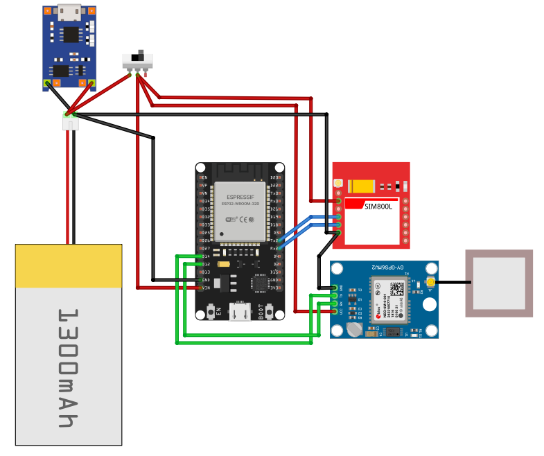
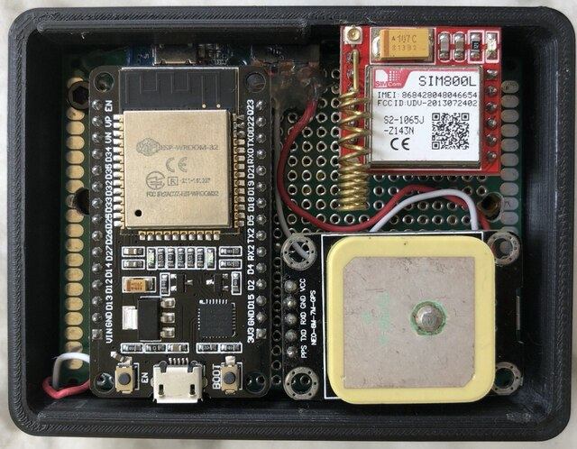
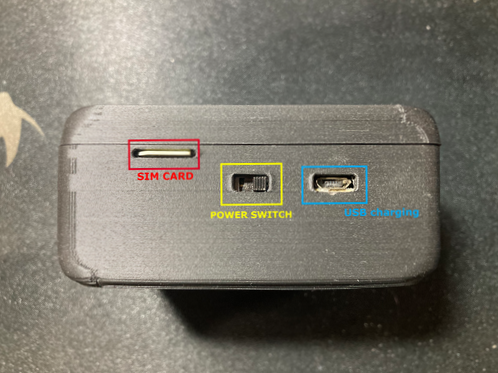

# GPS Tracker with SIM800L and NEO-6M (Arduino and Android)

This project consists of both an Arduino sketch and an Android app that allows you to track GPS coordinates using an ESP32 board, SIM800L GSM module, NEO-6M GPS module, and an Android smartphone. The GPS coordinates are sent from the ESP32 board to an MQTT broker for further processing or visualization and can be viewed on the Android app.

## Arduino (ESP32) Part

### Prerequisites

To use the Arduino sketch, you will need the following hardware components:

- ESP32 board
- SIM800L GSM module
- NEO-6M GPS module

Make sure you have the necessary libraries installed:

- [TinyGsm](https://github.com/vshymanskyy/TinyGSM)
- [TinyGPSPlus](https://github.com/mikalhart/TinyGPSPlus)
- [ArduinoJson](https://arduinojson.org/)
- [PubSubClient](https://pubsubclient.knolleary.net/)

### Configuration

Before uploading the sketch, you may need to modify the following settings:

- **GPRS credentials**: Set the correct Access Point Name (APN), GPRS username, and password for your GSM network provider.

- **MQTT broker details**: Set the server address (mqtt_server) and port (mqtt_port) for your MQTT broker. Also, update the `sensor1_topic` to your desired topic name.

- **Serial port settings**: If your ESP32 is connected to a different serial port than the default pins (16 and 17), update the `SIM800_RX` and `SIM800_TX` definitions accordingly.

### Wiring Diagram

 
 
   

## Android App Part

### Description

The Android app provides a user-friendly interface to view the GPS coordinates received from the ESP32 board through the MQTT broker. It also allows you to set up a virtual guard by defining a circular area with a specified radius.

### Prerequisites

To use the Android app, you need an Android smartphone or emulator with the following minimum requirements:

- Android 5.0 (Lollipop) or higher

### Features

- Display real-time GPS coordinates received from the ESP32 board.
- View the last update timestamp of the GPS data.
- Set up a virtual guard by defining a circular area with a specified radius.
- Receive notifications on the Android device when the tracked location goes outside or returns inside the virtual guard area.

### How to Use

1. Install the Android app on your Android smartphone or emulator.

2. Launch the app and provide the necessary permissions for location access and notifications.

3. Enter the MQTT broker details in the app settings (server address and port) to connect to the same MQTT broker used by the Arduino sketch.

4. The app will start receiving and displaying real-time GPS coordinates from the Arduino board.

5. To set up a virtual guard, specify the latitude, longitude, and radius of the circular area on the map view.

6. If the GPS location goes outside the virtual guard area, you will receive a notification on your Android device.

7. Similarly, you will receive a notification when the tracked location returns inside the virtual guard area.

## Embedded System

 
   
   

## License

This project is licensed under the [MIT License](LICENSE).

## Acknowledgments

- [TinyGsm](https://github.com/vshymanskyy/TinyGSM) - Library for communicating with GSM modules.
- [TinyGPSPlus](https://github.com/mikalhart/TinyGPSPlus) - Library for parsing GPS data.
- [ArduinoJson](https://arduinojson.org/) - Library for working with JSON data on Arduino.
- [PubSubClient](https://pubsubclient.knolleary.net/) - Library for MQTT communication on Arduino.
- [Google Maps Android API](https://developers.google.com/maps/documentation/android-sdk) - Used for displaying GPS coordinates on the Android app's map view.
- [Android Notifications](https://developer.android.com/training/notify-user/build-notification) - Used for sending notifications to the Android app.

**Note**: Please add your own API key for Google Maps Android API in the AndroidManifest.xml file.
